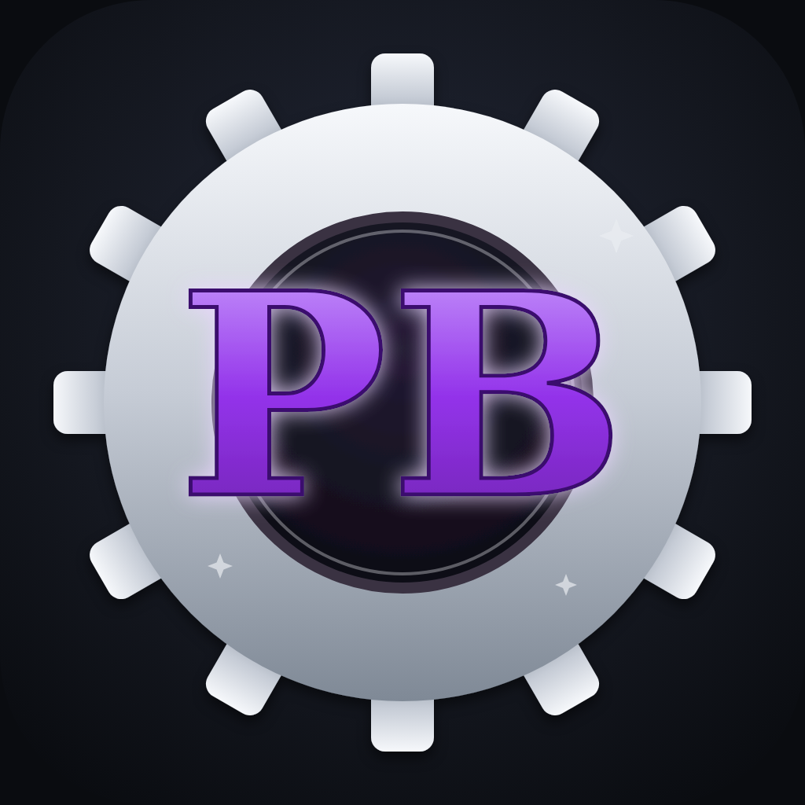
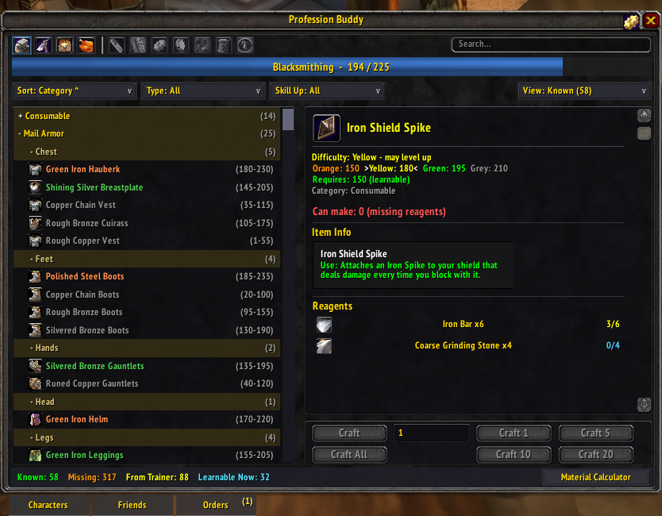
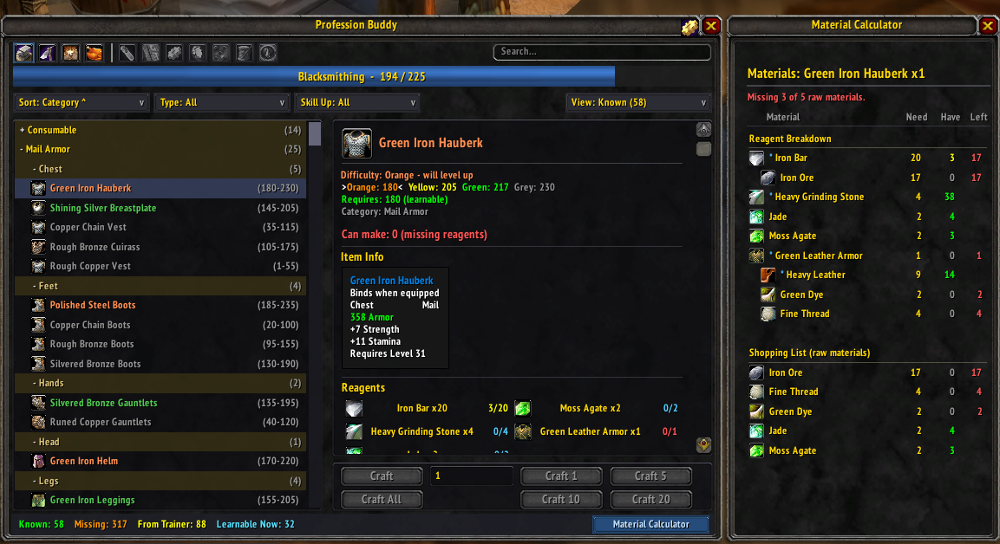
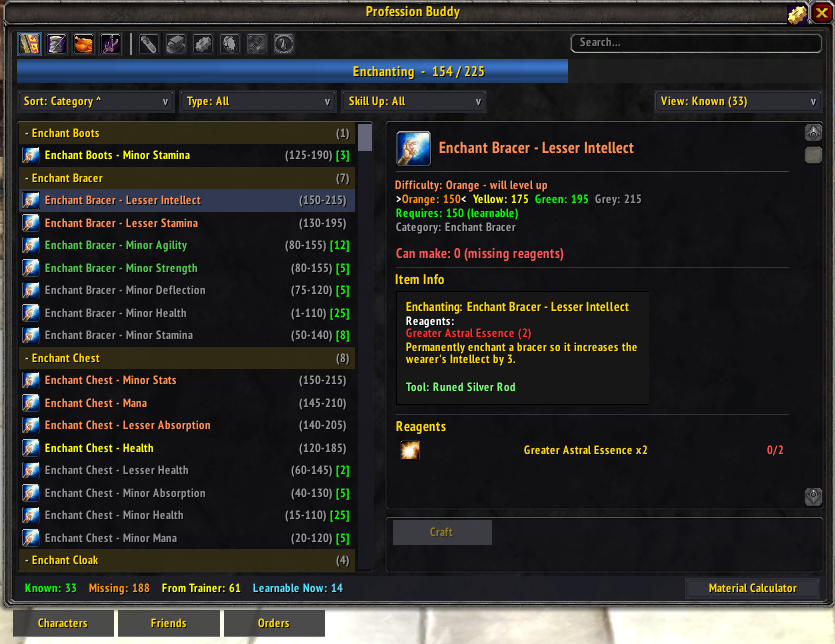
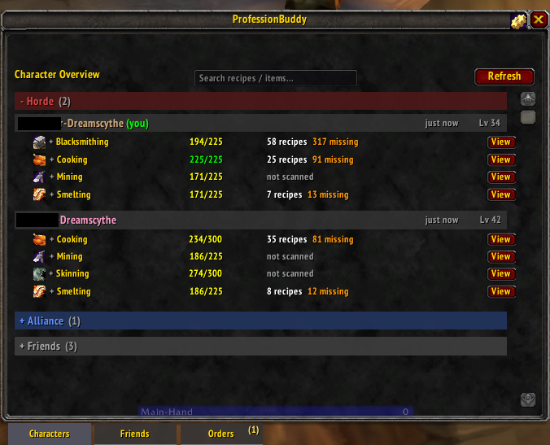
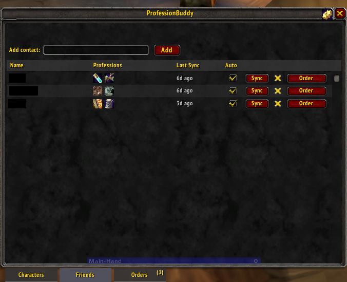
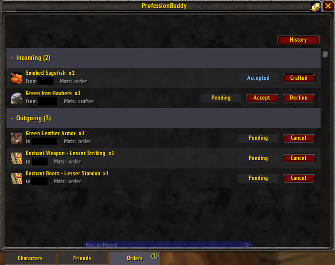
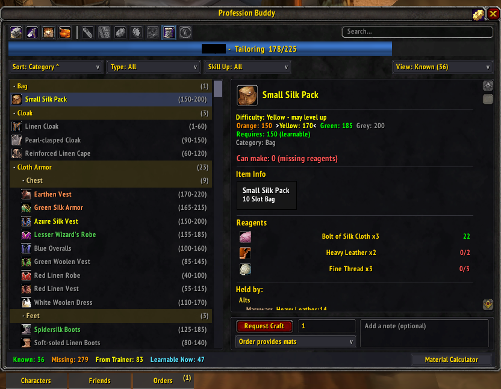
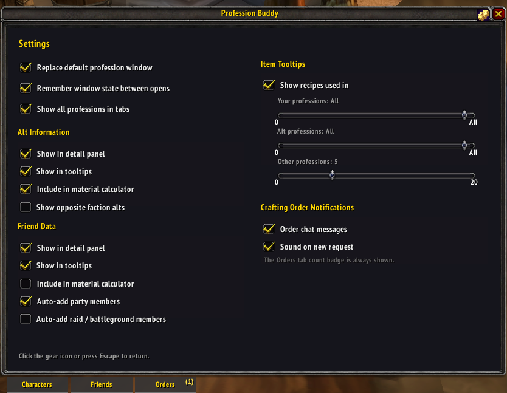

  

<h1 align="center">ProfessionBuddy</h1>

  A modern all-in-one profession window for World of Warcraft: Burning Crusade
  Classic (Anniversary realms, 2.5.6). See every character's recipes and
  materials at a glance, calculate exactly what to gather, and request crafts
  from friends.

  <a href="https://www.curseforge.com/wow/addons/professionbuddy"><strong>Download on CurseForge</strong></a>
  &nbsp;·&nbsp;
  <a href="https://github.com/m4ru92/ProfessionBuddy/issues">Report a bug</a>

## Screenshots

|  |  |
| :---: | :---: |
|  |  |
| Recipe browser with game-accurate difficulty colors | Material Calculator — full reagent tree + shopping list |
|  |  |
| Recipe details, reagents, and required rod | Every character's professions in one view |
|  |  |
| Friends' professions and materials, synced | Friend-to-friend crafting orders |
|  |  |
| Browse a friend's recipes and request a craft | Configurable settings |

## Features

- **Cross-character view** — every alt's professions, known recipes,
  and bag/bank inventory in one place, no logging in and out.
- **Material Calculator** — resolves the full reagent tree (including
  intermediate crafts), subtracts what you already own across your
  characters, and produces a shopping list.
- **Crafting Orders** — request a craft from a friend running
  ProfessionBuddy. Full lifecycle (request → accept → crafted →
  received) with chat notifications, a queue, and history. Offline
  friends are handled: the order is queued and auto-delivers when you
  are next both online.
- **Friend / group data sharing** — see grouped or contact players'
  professions, recipes, and materials (AceComm-based).
- **Accurate difficulty** — skill-up colors and skill ranges are
  built from Blizzard's client data (see *Recipe data* below), so
  they match the in-game trainer.
- **Alt-aware tooltips** — "Craftable by" (who can make this) and
  "Used in" (which recipes use this reagent).
- **Cross-character search** — items and recipes across all alts at
  once.
- **Batch crafting** — 1 / 5 / 10 / 20 / All with a live countdown
  and skill-bar updates.
- **State preservation** — window position, filters, sort, search,
  and selection persist.

Supported: Blacksmithing, Leatherworking, Tailoring, Engineering,
Alchemy, Jewelcrafting, Enchanting, Cooking, First Aid, and
Mining/Smelting.

## Installation

- **CurseForge / addon managers:** search "ProfessionBuddy" and
  install (recommended — auto-updates), or grab it from the
  [CurseForge page](https://www.curseforge.com/wow/addons/professionbuddy).
- **Manual:** download the latest release zip and extract the
  `ProfessionBuddy` folder into
  `World of Warcraft/_classic_/Interface/AddOns/`.

## Usage

Open any profession, or type `/pb` (or `/profbuddy`). The gear icon
in the window opens settings. Your saved data lives in
`WTF/.../SavedVariables/ProfessionBuddy.lua`.

## Recipe data

Skill ranges and difficulty colors are generated from Blizzard's
client DB2 (`SkillLineAbility` + `SpellName`) for the current build
via [wago.tools](https://wago.tools), as
`skillRange = {learn, trivLow, floor((trivLow+trivHigh)/2), trivHigh}`.
Learn levels (the trainer "requires" value) are not present in DB2
(`MinSkillLineRank` is 1), so those are trainer-sourced. On a new
client build, re-pull and regenerate.

## Reporting bugs

Install [!BugGrabber](https://www.curseforge.com/wow/addons/bug-grabber)
and [BugSack](https://www.curseforge.com/wow/addons/bugsack),
reproduce the issue, and open an issue with the full Lua error. A
bug-report template is provided.

## Building / packaging

Currently released as a manually built zip (single `ProfessionBuddy/`
folder at the root, excluding backup files). A `.pkgmeta` for the
CurseForge GitHub packager is planned.

## License

[MIT](LICENSE). Bundled libraries under `Libs/` (LibStub,
CallbackHandler-1.0, ChatThrottleLib, Ace3: AceComm-3.0,
AceSerializer-3.0) retain their own permissive licenses.

## Credits

Created by m4ru. Built on the Ace3 library suite.
